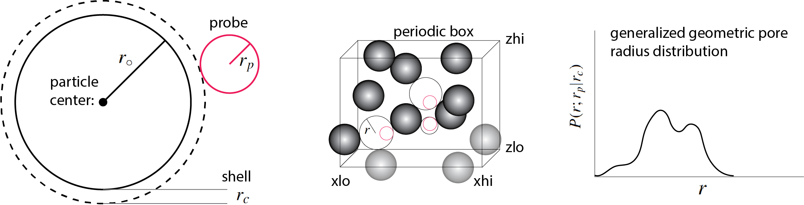

# CODE-GPSD-3D
Generalized geometric pore size distribution (G-PSD) for periodic systems composed of spheres. This quantity was defined by Gelb and Gubbins, there are other pore size distributions such as T-PSD, as discussed in detail in the accompanying [article](#about). The spheres constitute the 'material', which is surrounded by 'pore space'. This codes allows to calculate the distribution *P(r;rp|rc)*  of pore radii *r* for such system as function of the radius *rp* of a thought probe particle and a thought coating thickness *rc* of the material spheres. 

  

For monodisperse systems GPSD-3D uses the advanced (grid-free) voronoi-based algorithm. For polydisperse systems, it uses a basic grid-based algorithm, whose resolution is limited by the amount of available memory. The settings of the grid-based algorithm are hard-coded in the file GPSD-3D, and can be modified there (see [below](#hardcoded) for details).  

## Installation

Create a new directory named GPSD-3D. Download GPSD-3D.tar.gz to the new directory GPSD-3D and unpack it via 

    gunzip GPSD-3D.tar.gz; tar -x GPSD-3D.tar; 

This will create the following files: GPSD-3D.f90, and GPSD-3D-grid.f90, voro-parser.cpp, get-max-threads.f90, INSTALL.pl, TEMPLATE.pl, MESSAGE.txt. Then switch to the new directory and call the installation script via

    perl ./INSTALL.pl

This will produce some message on your screen like 

      
    This is GPSD-3D version 1.0 written by Martin Kroger 2023, ETH Zurich, https://www.complexfluids.ethz.ch, Email: mk@mat.ethz.ch

    Related publication (GPSD-3D): Comput. Phys. Commun. (2023) submitted
    Related publication (GPSD-2D): Phys. Rev. E 107 (2023) 015307. Link: http://doi.org/DOI:10.1103/PhysRevE.107.015307

    GPSD-3D Code available from: https://github.com/mkmat/CODE-GPSD-3D
    GPSD-2D Code available from: https://github.com/mkmat/CODE-GPSD-2D

and a new file GPSD-3D (a perl script). Ideally, it finishes with saying 

    You have successfully installed GPSD-3D
    Copy GPSD-3D (just this single file) to a directory where you'll need it or where it can be found.
    Then call (i) GPSD-3D or (ii) ./GPSD-3D or (iii) perl GPSD-3D to start GPSD-3D (includes documentation)

But, if you have voro++ not yet installed, or no fortran compiler, you will end up with an error message that provides you with a download link. In this case you need to do the installation, and call the installation script INSTALL.pl again. 

## Configuration and box file formats <a name=format>

The input required by GPSD-3D are (i) coordinates: the center positions of *N* monodisperse or polydisperse spheres, that are located inside a rectangular, periodic box, whose corners are specified by (ii) box geometry: 6 values: xlo,xhi,ylo,yhi,zlo,zhi. We offer various file formats, where each of the *N* lines contains the coordinates, and eventually also the radius of a single sphere

1. x y z (monodisperse system, requires specifying -ro on the command line)
2. id x y z (monodisperse system, requires specifying -ro on the command line)        
3. id x y z radius  (polydisperse system, monodisperse if all radii are equal)
4. samarth-type configuration file (do not specify box dimensions in that case, requires specifying -ro on the command line)

The six values for the box can be either saved in a txt-file (single line, six values xlo xhi ylo yhi zlo zhi separated by blank or commata), or passed over on the command line.  

## How to run the code. Parameters. Command-line options

      perl GPSD-3D
          -in=<filename>
          -box=<filename> OR -xlo=.. -xhi=.. ylo=.. -yhi=.. -zlo=.. -zhi=..
          [-ro=<positive value>] 
          [-rp=<value>] 
          [-rc=<value>] 
          [-q=<integer>] 
          [-o=<filename>]
          [-np=<integer>]
          [-more]
          [-info]
          [-quiet]
          [-clean]

**-in=**    name of the file containing the material sphere [coordinates](#format) (for polydisperse systems also the sphere radii).

**-box=**   name of the file containing the box [geometry](#format) (alternatively, the box size can be passed over on the command line using -xlo= .. -zhi=..).

**-ro=** material circle radius *ro* (required, if the particle radii are not contained in the input file). If *ro* is specified, existing radii in the input file are ignored).

**-rp=** probe particle radius *rp*. If not specified, *rp=0* is used.

**-rc=** shell thickness  *rc*. If not specified, *rc=0* is used.

**-q=** positive quality value (optionally). If not specified, *q=10* is used. The number of random shots is *q* times the number of material spheres.

**-o=** name of the resulting file containing a list of pore radii. If not specified, the list is saved in a .gpsd-file.

**-np=** number of threads np to be used. If not specified, *np* is set to the available number of threads.

**-more**: tell the code to add, besides pore radius, the corresponding pore center coordinate to the output file.

**-info**: triggers storing runtime information (cpu times etc) in a separate [info](#info) file.

**-quiet**: prevents GPSD-3D to create stdout.

**-clean**: removes all temporary directories that may have been generated during previous crashes.

### Comments: 

1. The leading 'perl' is only needed, if your system does not automatically recognize GPSD-3D to be a perl file. If GPSD-3D is not found, call it via: perl ./GPSD-3D.
2. If called without any argument, GPSD-3D displays the documentation.
3. GPSD-3D can be called in parallel. 
4. Each GPSD-3D call runs in a unique temporary directory, upon successful completion the temporary directory is removed.
5. The maximum number of threads used by OpenMP is reported during the installation and also if GPSD-3D is called without arguments. For very large systems with, say, more than 1000000 spheres, running at the maximum number of threats must not be an advantage and you should check the speed also using a single processor, using -np=1
6. Negative values *rp* and *rc* are allowed as long as *rp*+*rc*+*ro* is positive. A [negative coating thickness](#about) effectively reduces the material sphere radius.

## Output

GPSD-3D returns a list of pore radii *r* in a file, either in configfilename.gpsd or outputfilename, if the latter had explicitly been defined on the command line. 

        0.658312
        0.274754
        1.070546
        0.685289
        ...

This list of *r* values (for the chosen values *rp* and *rc*) gives rise to a distribution of pore radii, so called generalized geometric pore radius distribution *P(r;rp|rc)*. The bare radius of the particles *ro* is usually not mentioned here, as it belongs to the system. For monodisperse systems only the sum or *ro+rc* matters. For polydisperse systems each spherical particle has its own radius according to the configuration file, and *rc* can be used to effectively modify the stored particle radii, without changing the configuration file. If you call GPSD-3D with the -more option, the same file will contain four columns (no header)

        r        x    y    z
        0.658312 1.31 2.13 1.99
        0.274754 2.30 1.01 4.02
        1.070546 ...
        0.685289 ...
        ...

where *x*,*y*,*z* are the center coordinates of the pore with radius *r*.

## Test configurations and test runs

A number of configurations and corresponding box-files are available from the current respository. They are named .benchmark-x-config and .benchmark-x-box. A test call, using 10 of the available threads, 20000 Monte Carlo trials (*q=10*), for a probe sphere with zero radius, and *N=2000* materials spheres of radius *r*o=1.0 is 

        perl ./GPSD-3D -in=.benchmark-7-config -box=.benchmark-7-box -rp=0.0 -ro=1.0 -q=10 -np=10

As we did not suppress stdout via -quiet, it should produce the following within a few seconds:

       _______________________________________________________________________________________________________________________________

        This is GPSD-3D version 1.0 written by Martin Kroger 2023, ETH Zurich, https://www.complexfluids.ethz.ch, Email: mk@mat.ethz.ch

        Related publication (GPSD-3D): Comput. Phys. Commun. (2023) submitted
        Related publication (GPSD-2D): Phys. Rev. E 107 (2023) 015307. Link: http://doi.org/DOI:10.1103/PhysRevE.107.015307

        GPSD-3D Code available from: https://github.com/mkmat/CODE-GPSD-3D
        GPSD-2D Code available from: https://github.com/mkmat/CODE-GPSD-2D
        _______________________________________________________________________________________________________________________________

        [INFO] using configuration file .benchmark-7-config
        [INFO] using box file .benchmark-7-box
        [PREPARING] scanning .benchmark-7-box
        [PREPARING] recognized format (B)
        [INFO] monodisperse: 1
        [INFO] .benchmark-7-config contains 2000 particle coordinates (4 columns)
        [INFO] created files in .tmp-GPSD-3D-49303 including .parameters.
        [INFO] monodisperse system. The particle radius is taken as 1, shell thickness 0, test particle radius 0.
        [GPSD-3D] Using 20000 shots on 10 threads
        [GPSD-3D] Please stand by ..
        [GPSD-3D]                               reading box ..
        [GPSD-3D]                                          box      24.0000       24.0000       24.0000
        [VORO++]                                  max vertices           53
        [VORO++]                                     max faces           26
        [VORO++]                             max face-vertices           12
        [GPSD-3D]                                    triangles        59622
        [GPSD-3D]                      parallel processes (np)           10
        [GPSD-3D]                         material spheres (N)         2000
        [GPSD-3D]                              UpperPoreRadius       2.8465
        [GPSD-3D]                                           ro       1.0000
        [GPSD-3D]                                           rc       0.0000
        [GPSD-3D]                                           rp       0.0000
        [GPSD-3D]                                 reff = rc+rp       0.0000
        [GPSD-3D]                                 rs = ro+reff       1.0000
        [GPSD-3D]                       max triangle extension       2.8398
        [GPSD-3D]                    creating neighbor list ..
        [GPSD-3D]                               neighborlist_M            4             4             4
        [GPSD-3D]                            neighborlist_size       6.0000        6.0000        6.0000
        [GPSD-3D]                           triangles per cell     931.5938
        [GPSD-3D]                      starting Monte Carlo ..
        [GPSD-3D]                    volume fraction phi(reff)       0.3767
        [GPSD-3D]                                    V(0|reff)    8617.1904
        [GPSD-3D]                              min pore radius       0.0179
        [GPSD-3D]                             mean pore radius       1.5525 +/-    0.0033
        [GPSD-3D]                              max pore radius       2.8465
        [GPSD-3D]             created a list {r} of pore radii
        [GPSD-3D]                    shots (use -q to enlarge)        20000
        [GPSD-3D]       cpu+real time spent in overhead [secs]       0.0002        0.0000
        [GPSD-3D]      cpu+real time spent in read_voro [secs]       0.1144        0.2500
        [GPSD-3D]cpu+real time spent in setup_triangles [secs]       0.0005        0.0000
        [GPSD-3D]     cpu+real time spent in MonteCarlo [secs]      16.4258        1.6250
        [GPSD-3D]         cpu+real time per 10000 shots [secs]       8.2129        0.8125
        [GPSD-3D] completed
        [GPSD-3D] created: .benchmark-7-config-ro=1-rp=0-rc=0.gpsd

and the following file (a list of roughly 20000 *r* values) should have been generated (if you do not see it, type: ls -lat): 

        .benchmark-7-config-ro=1-rp=0-rc=0.gpsd

With such list of values at hand, creating the normalized histogram (the pore radius distribution) is straightforward using any software that can bin the values, and visualize a graph. Some quantities derived from the list, such as minimum and maximum pore radius, as well as the mean pore radius including its standard error are mentioned in the above stdout. If you are not satisfied with the name of the resulting file, use the -o option. If you repeat the above command, now using the -info option

        perl ./GPSD-3D -in=.benchmark-7-config -box=.benchmark-7-box -rp=0.0 -ro=1.0 -q=10 -np=10 -info

a second file will have been generated (all entries in this file are described <a href="#info">below</a>

        [GPSD-3D] created: .benchmark-7-config-ro=1-rp=0-rc=0.gpsd-info

        2000
        1.0000000000000000
        0.0000000000000000
        0.0000000000000000
        13824.000000000000
        59622
        20000
        12467
        2.8465461581708604
        1.7858377514456736E-002
        1.5524619675473206
        2.8465461581708600
        3.2635904069227960E-003
        0.37665000000000004
        64
        10
        0.114386998
        0.250000000
        4.58002090E-04
        0.00000000
        16.4257870
        1.62500000
        1.96279191970825

## Polydisperse systems: Grid-based <a name="hardcoded">

For the case of polydisperse systems, the GPSD-3D script contains two lines that may be edited by users to increase or reduce the resolution further. The default setting is:  

        $min_delta_grid     = 0.005;      # USER-defined minimum grid spacing (in units of the effective particle radius ro+rc)
        $maxvoxels_grid     = 1000000;    # USER-defined upper limit for number of voxels 

## -info file <a name="info">

    N (number of material spheres)
    ro (material sphere radius)
    rp (probe sphere radius)
    rc (shell thickness)
    box volume
    total number of triangles
    total number of shots
    total number of pore radius values
    maximum pore radius
    minimum pore radius
    mean pore radius
    maximum pore radius detected
    standard error of the mean pore radius
    volume fraction phi(reff)
    number of neighbor cells
    np number of threads used in parallel
    cpu time used to process the voro++ output [secs]
    real time used to process the voro++ output [secs]
    cpu time used to setup triangles [secs]
    real time used to setup triangles [secs]
    cpu time spent during Monte Carlo [secs]
    real time spent during Monte Carlo [secs]
    total wall time [secs]

## Benchmarks

Benchmark configurations are available as .benchmark-#-config and .benchmark-#-box files. 

| no | *N* | *ro* | *rp* | *rc* | *q* | *np* | *S* | triangles | $\langle r\rangle$ | *rmax* | voro++ | total |
|---|---|---|---|---|---|---|---|---|---|---|---|---|
|1 | 16 | 0.1 | 0 | 0 | 6251 | 30 | 100016 | 490 | 1.46 | 1.6 | 0 s | 0.3 s | 
|2 | 40 | 0.1 | 0 | 0 | 2501 | 30 | 100040 | 1494 | 41.34 | 43.76 | 0 s | 0.29 s | 
|3 | 16 | 0.1 | 0 | 0 | 6251 | 30 | 100016 | 553 | 1.55 | 1.66 | 0 s | 0.25 s | 
|4 | 100000 | 0.1 | 0 | 0 | 2 | 30 | 200000 | 4058940 | 2.47 | 3.86 | 20 s | 31.35 s | 
|5 | 139218 | 0.1 | 0 | 0 | 1 | 30 | 139218 | 3917190 | 1.38 | 2.14 | 22.5 s | 27.16 s | 
|6 | 1600 | 0.1 | 0 | 0 | 63 | 30 | 100800 | 19752 | 1.31 | 1.31 | 0.25 s | 1.54 s | 
|7 | 2000 | 0.1 | 0 | 0 | 51 | 30 | 102000 | 59622 | 2.57 | 3.75 | 0.25 s | 5.42 s | 
|8 | 10000 | 0.1 | 0 | 0 | 11 | 30 | 110000 | 307609 | 3.21 | 4.83 | 1.5 s | 8.55 s | 
|9 | 139218 | 0.1 | 0 | 0 | 1 | 30 | 139218 | 3917190 | 1.38 | 2.14 | 21 s | 26.21 s | 
|10 | 1600 | 1 | 0 | 0 | 63 | 30 | 100800 | 19752 | 0.34 | 0.41 | 0.38 s | 1.59 s | 
|11 | 1600 | 1 | 0.1 | 0 | 63 | 30 | 100800 | 19752 | 0.38 | 0.41 | 0.38 s | 1.51 s | 
|12 | 1600 | 1 | 0.1 | 0.1 | 63 | 30 | 100800 | 19752 | 0.29 | 0.31 | 0.25 s | 1.22 s | 
|13 | 1600 | 1 | 0 | 0 | 63 | 3 | 100800 | 19752 | 0.34 | 0.41 | 0.25 s | 11.12 s | 

## About <a name="about">

Related publication (GPSD-3D): Comput. Phys. Commun. (2023) submitted

Related publication (GPSD-2D): Phys. Rev. E 107 (2023) 015307. Link: http://doi.org/DOI:10.1103/PhysRevE.107.015307

GPSD-3D Code available from: https://github.com/mkmat/CODE-GPSD-3D

GPSD-2D Code available from: https://github.com/mkmat/CODE-GPSD-2D
